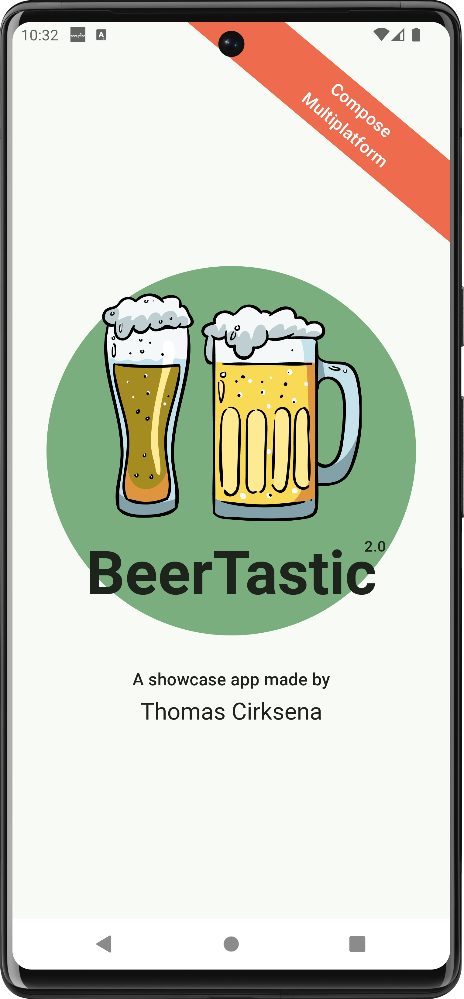
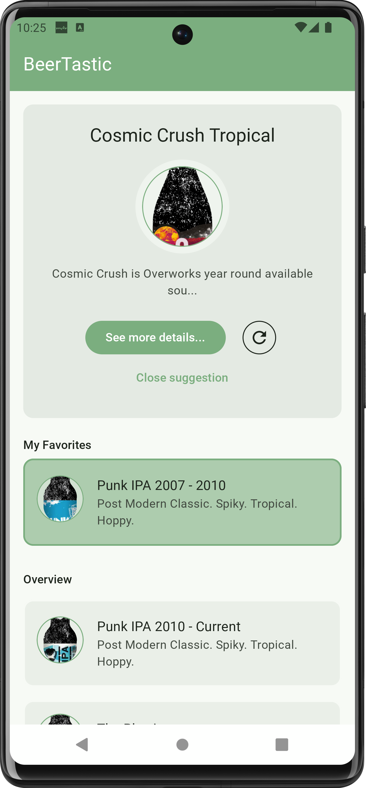
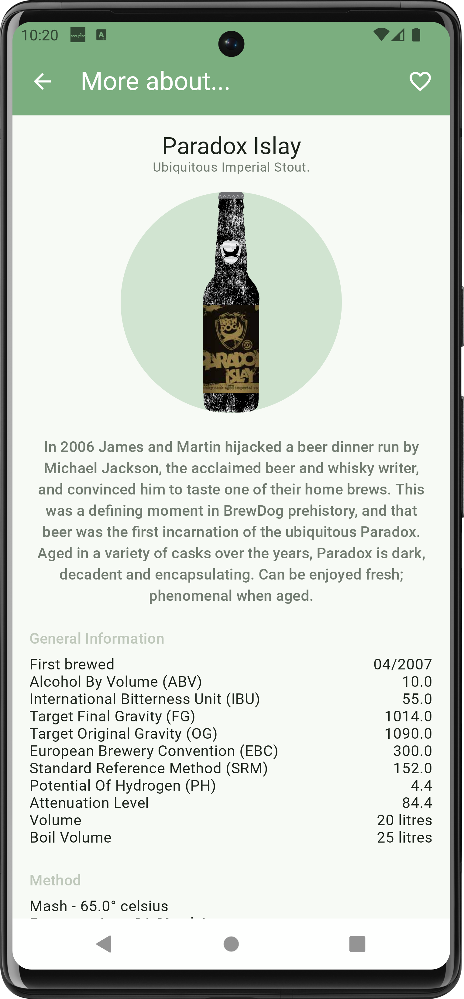
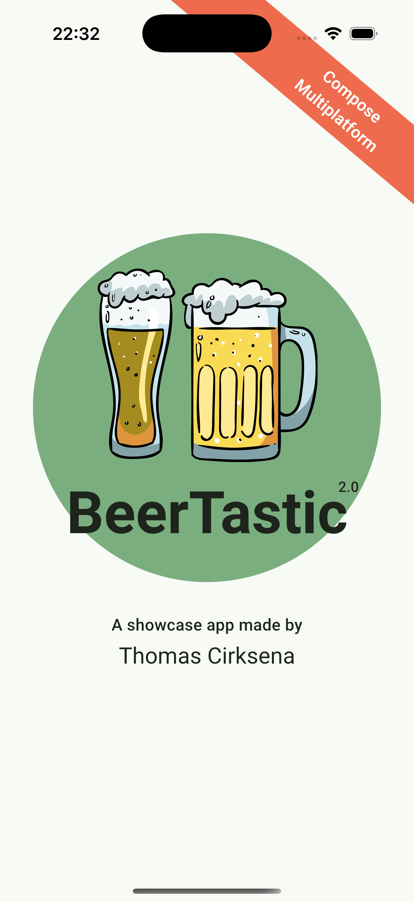
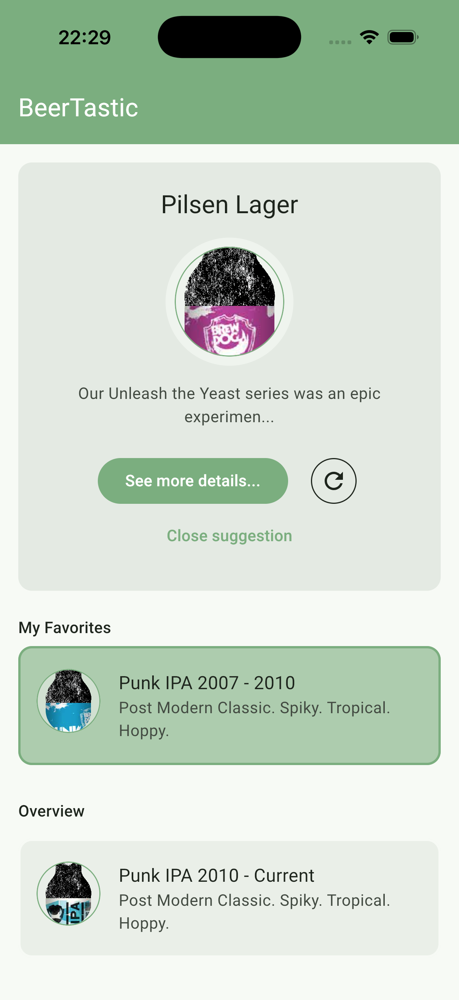
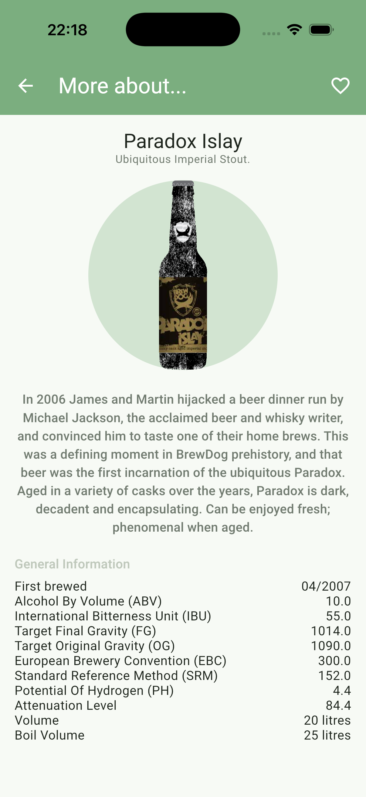

<h1 align="center">🍺 BeerTastic CMP</h1>

<p align="center">
  <a href="https://opensource.org/licenses/MIT"></a>
  <a href="https://android-arsenal.com/api?level=26"></a>
  <a href="https://github.com/grumpyshoe/BeerTasticCMP/actions"></a>
</p>

<p align="center">
  <em>A Compose Multiplatform showcase app built with Clean Architecture, Jetpack Compose, and the Punk API.</em>
</p>

---
### Android:
<div align="center">
  
  
  
</div>

### iOS:
<div align="center">
  
  
  
</div>

---

## 🏁 Introduction

**BeerTastic CMP** is a showcase Compose Multiplatform app that demonstrates how to build scalable, maintainable, and testable projects following **Clean Architecture** principles.  
It serves as a practical example of modern Android and iOS development with **Jetpack Compose** and **Kotlin**.

---

## 🍻 App Overview

The app retrieves beer data from https://punkapi-alxiw.amvera.io/v3, a maintained fork of the official [Punk API](https://punkapi.com/documentation/v2).  
This fork is used because the original API experiences frequent downtime and is often unavailable.

### ✨ Features
- Infinite scrolling beer list on the home screen
- Option to display a **random beer**
- Detailed view for each beer with extended information
- Mark beers as **favorites** — favorites are highlighted and displayed at the top of the list for quick access

---

## 🧱 Architecture

The project follows the **Clean Architecture** pattern to ensure high testability, separation of concerns, and modularity.  
Communication between UI and ViewModel is based on an MVI-style architecture, enabling a unidirectional data flow.

At the top level, the project consists of the following modules:

### Project Structure
```
:composeApp         → Main application module, shared UI and presentation logic
:data                → Handles API calls, repositories, and data sources  
:domain              → Contains use cases and business logic  
:iosApp              → iOS application entry point
:presentation        → Shared presentation logic between platforms
  ├─ :common         → Shared UI components, themes, and resources  
  ├─ :features
  │   ├─ :home       → Beer list and random beer screen  
  │   ├─ :details    → Detailed beer information screen  
  │   └─ :splashscreen → App startup screen
:testing
  └─ :fakes          → Contains fake implementations for unit tests.
```

The UI is fully built with **Jetpack Compose**.

---

## ⚙️ Tech Stack

| Category | Technology |
|-----------|-------------|
| **Language** | [Kotlin](https://kotlinlang.org/) |
| **UI Framework** | [Jetpack Compose](https://developer.android.com/jetpack/compose) |
| **Architecture** | Clean Architecture, Compose Multiplatform |
| **Async Programming** | [Kotlin Coroutines](https://kotlinlang.org/docs/coroutines-overview.html), [Flow](https://kotlinlang.org/docs/flow.html) |
| **Dependency Injection** | [Koin](https://insert-koin.io/) |
| **Networking** | [Ktor](https://ktor.io/) |
| **Build System** | Gradle (Modularized Setup) |

---

## 🚀 Getting Started

### 1. Clone the repository
```bash
git clone https://github.com/grumpyshoe/BeerTasticCMP.git
cd BeerTasticCMP
```

### 2. Open the project
Open the project in **Android Studio**.

### 3. Build and run
The should start on click `Run` in **Android Studio**. There is no API-Key needed for this app.

You can now explore the app on an emulator or physical device (API level 26+).

---
### 🧪 Run unit tests
```bash
./gradlew allTest --info --stacktrace
```

---

## 📜 License

This project is licensed under the [MIT License](https://opensource.org/licenses/MIT).

---

## 👨‍💻 About the Author

**Thomas Cirksena**  
📧 [thomas.cirksena@gmail.com](mailto:thomas.cirksena@gmail.com)  
🌐 [github.com/grumpyshoe](https://github.com/grumpyshoe)  
💼 [linkedin.com/in/thomas-cirksena](https://www.linkedin.com/in/thomas-cirksena)

---

> _“Code is like beer — it’s best when it’s clean and well-crafted.”_ 😉